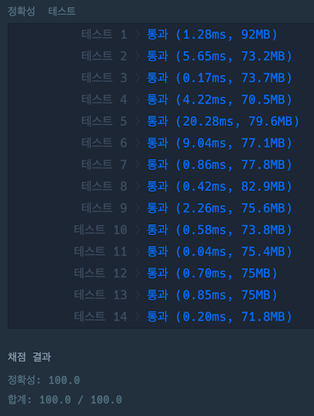
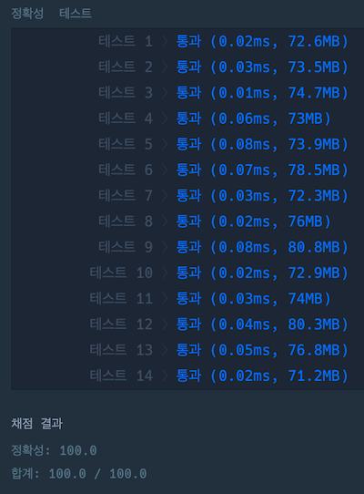
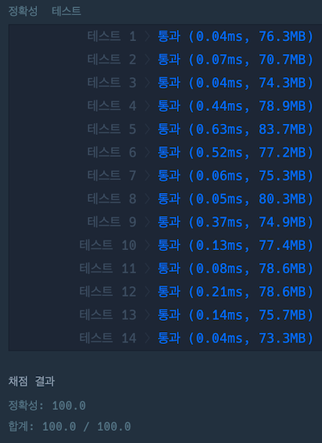

---
tags:
  - Queue
  - Java
  - DSA
---
# 다리를 지나는 트럭

## 직관적으로 큐를 사용한 풀이

```java
import java.util.ArrayDeque;

class Solution {
    public int solution(int bridge_length, int weight, int[] truck_weights) {
        int time = 0;
        ArrayDeque<Integer> bridge = new ArrayDeque<>(bridge_length);
        int bridgeUsage = 0;
        int truckIndex = 0;

        for (int i = 0; i < bridge_length; i++) {
            bridge.add(0);
        }

        while (truckIndex < truck_weights.length || bridgeUsage > 0) {
            time++;
            bridgeUsage -= bridge.poll();
            int docSize = 0;
            if (truckIndex < truck_weights.length
                && truck_weights[truckIndex] + bridgeUsage <= weight) {
                docSize = truck_weights[truckIndex++];
                bridgeUsage += docSize;
            }
                bridge.add(docSize);
        }

        return time;
    }
}
```



- 시간 복잡도: $O(\verb|bridge_length|\times\verb|truck_weights.length|)$  
최악의 경우 트럭이 무거워서 다리를 1대씩 건너가면 다리 길이와 트럭 대수를 곱한 만큼 루프를 돈다.
- 공간 복잡도: $O(\verb|bridge_length|)$

`while`문에서 `time` 변수를 1씩 증가시키고 `bridge`의 원소를 하나씩 빼고 넣는 것을 통해 최종 시간을 계산하였다.  
직관적으로 트럭이 한 칸씩 움직이는 것을 떠올릴 수 있다.  
무거운 트럭이 매우 긴 다리를 건너게 되면 다리를 지나는 동안 불필요하게 시간을 보낸다는 점이 아쉽다.

## 트럭이 다리를 건너는 시점을 저장하여 루프 횟수를 줄인 풀이

```java
class Solution {
    public int solution(int bridge_length, int weight, int[] truck_weights) {
        int time = 0;
        int[] timeCrossed = new int[truck_weights.length];
        int bridgeUsage = 0;
        int bridgeIndex = 0;
        int truckIndex = 0;

        while (truckIndex < truck_weights.length) {
            if (truck_weights[truckIndex] + bridgeUsage <= weight) {
                bridgeUsage += truck_weights[truckIndex];
                timeCrossed[truckIndex++] = ++time + bridge_length;

                if (timeCrossed[bridgeIndex] == time) {
                    bridgeUsage -= truck_weights[bridgeIndex++];
                }
            } else {
                bridgeUsage -= truck_weights[bridgeIndex];
                time = timeCrossed[bridgeIndex++];

                if (truck_weights[truckIndex] + bridgeUsage <= weight) {
                    bridgeUsage += truck_weights[truckIndex];
                    timeCrossed[truckIndex++] = time + bridge_length;
                }
            }
        }
        
        return timeCrossed[truck_weights.length - 1];
    }
}
```



- 시간 복잡도: $O(\verb|truck_weights.length|)$  
2개의 인덱스가 1씩 증가한다고 해도 트럭 개수의 2배만큼만 루프를 돌면 된다.
- 공간 복잡도: $O(\verb|truck_weights.length|)$

더 이상 다리에 트럭이 진입하지 못하는 상황에는  `time` 변수를 1씩 증가시키는게 아니라 다리의 맨 앞에 있는 트럭이 지나가는 시간을 바로 `time`에 넣도록 했다.  
`timeCrossed` 배열은 해당 인덱스의 트럭이 다리를 건너는 시점을 담고 있는데 이를 이용하면 중간 결과도 확인할 수 있다.  
`bridgeIndex`와 `truckIndex` 사이에 해당하는 트럭들이 다리에 존재하는 것인데 두 인덱스가 이동하면서 다리는 개념상 선입선출 구조, 큐와 같이 동작하게 된다.  
프로그래머스 채점 결과로 봤을 때 확실히 앞의 풀이보다 속도면에서 큰 이득이 있었다.

시간을 배열로 저장하지 않고 큐나 데크를 사용해도 가장 마지막에 저장되는 값이 원하는 답이 되므로 큰 차이 없이 구현 가능하다. 중간 결과가 필요 없고 트럭 대수가 많은 경우에는 큐나 데크를 사용하여 공간복잡도를 트럭 대수가 아닌 다리 길이에 맞출 수 있다. ($O(\verb|bridge_length|)$)

## `ArrayDeque`를 사용하여 다리를 건너는 시간을 저장한 풀이

```java
import java.util.ArrayDeque;

class Solution {
    public int solution(int bridge_length, int weight, int[] truck_weights) {
        int time = 0;
        ArrayDeque<Integer> bridge = new ArrayDeque<>(bridge_length);
        int bridgeUsage = 0;
        int bridgeIndex = 0;
        int truckIndex = 0;

        while (truckIndex < truck_weights.length) {
            if (truck_weights[truckIndex] + bridgeUsage <= weight) {
                bridgeUsage += truck_weights[truckIndex++];
                bridge.add(++time + bridge_length);

                if (bridge.getFirst() == time) {
                    bridgeUsage -= truck_weights[bridgeIndex++];
                    bridge.poll();
                }
            } else {
                bridgeUsage -= truck_weights[bridgeIndex++];
                time = bridge.poll();

                if (truck_weights[truckIndex] + bridgeUsage <= weight) {
                    bridgeUsage += truck_weights[truckIndex++];
                    bridge.add(time + bridge_length);
                }
            }
        }
        
        return bridge.getLast();
    }
}
```



- 시간 복잡도: $O(\verb|truck_weights.length|)$
- 공간 복잡도: $O(\verb|bridge_length|)$

위에 있는 풀이에서 배열 부분을 데크로 바꿔서 구현하였다.  
프로그래머스에서 채점한 결과로 보면 시간, 공간적으로 크게 이득을 보는 부분이 없는 것을 확인할 수 있다.  
테스트케이스에 따라 메모리 측면에서는 이득을 보는 경우가 있으나 속도면에서는 확실히 이득이 없었다.  
주어진 테스트케이스에서는 컬렉션의 오버헤드가 더 크게 작용했다고 볼 수 있다.

## *References*

- [다리를 지나는 트럭](https://school.programmers.co.kr/learn/courses/30/lessons/42583)
- [ArrayDeque](https://docs.oracle.com/en/java/javase/21/docs/api/java.base/java/util/ArrayDeque.html)
