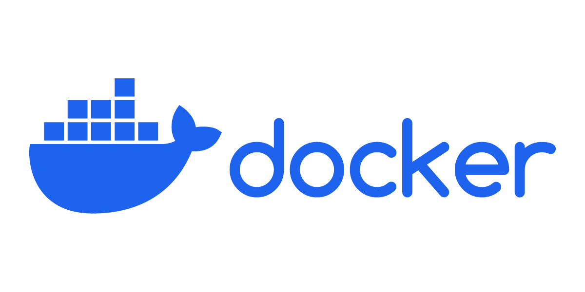
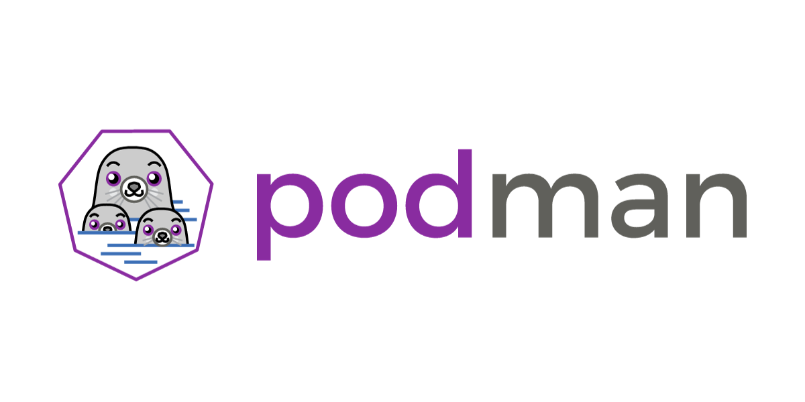
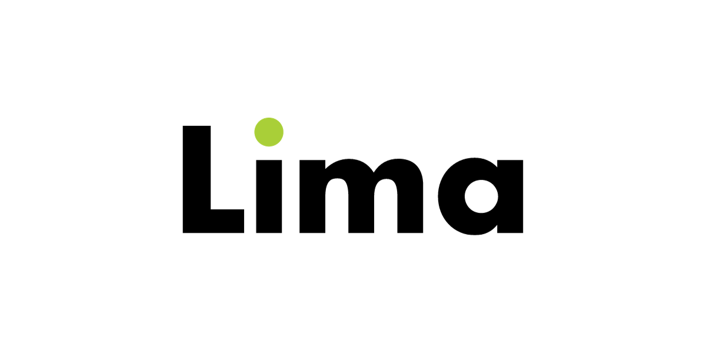

---
tags:
  - Docker
  - Mac
  - Podman
  - Lima
---
# Mac에서 Docker 사용하기

Docker는 **Linux 컨테이너**를 만들고 사용하기 때문에 Linux가 아닌 Mac이나 Windows 환경에서 사용하려면 **가상화**가 필요하다. 다시 말해, Linux에서는 간단하게 Docker Engine만 설치하면 Docker CLI를 사용할 수 있지만 Mac이나 Windows에서는 가상화를 도와주는 툴을 설치할 수 밖에 없다.  

Windows를 사용할 때는 [**WSL**](https://learn.microsoft.com/en-us/windows/wsl/)이라는 확실한 답이 있어서 크게 고민할 필요가 없었다. Docker Desktop을 사용했을 때도 내부적으로 WSL 상에서 동작했고 직접 WSL에 Docker Engine을 설치해서 CLI만 사용하는 것도 큰 무리가 없었다.

하지만 Mac은 상황이 달랐다. Mac은 Linux와 같은 [**POSIX**](https://en.wikipedia.org/wiki/POSIX) 환경이라서 Linux 가상화의 필요성이 적다보니 WSL 같은 확실한 답이 없고 **선택지가 다양한 느낌**이었다. 그래서 난 내 입맛에 맞게 여러 세팅을 옮겨 다니게 되었는데, 내가 Mac에서 Docker를 사용하기 위해 어떻게 세팅했었고 왜 다른 세팅으로 옮겼는지, 현재는 어떤 세팅을 사용 중인지 정리해봤다.

<!-- truncate -->

## Docker Desktop



Docker를 Mac에서 사용하는 공식적인 방법은 Docker Desktop을 설치하는 것이다. 내 맨 처음 세팅도 Docker Desktop이었다.

Docker Desktop은 [Docker 공식 사이트](https://www.docker.com/)에 들어가면 바로 다운로드할 수 있다. 설치 후 보통 Mac 응용 프로그램처럼 사용하면 된다. Docker Desktop을 실행시키면 터미널에서 Docker CLI도 사용가능해진다.

### Docker Desktop을 사용하지 않게 된 이유

Docker 공식 툴이고 GUI와 Kubernetes 등 다양한 기능을 가지고 있다는 장점도 분명히 있다. 하지만 내가 느끼기엔 **무거웠다.** Docker Engine의 CLI로 사용하는 기능만으로도 사실 충분하고 IDE에 존재하는 Docker 플러그인 등을 사용하면 GUI로도 충분히 사용가능한데 굳이 Docker Desktop이라는 프로그램을 따로 실행시킨다는 것이 별로라고 느껴졌다.

[직원이 250명 이상이거나 연매출이 1000만 달러 이상인 기업의 경우 유료 구독이 필요하도록 바뀌었다는 점](https://www.docker.com/blog/updating-product-subscriptions/)도 마음에 걸렸다. 경제적 이유로 Docker Desktop을 사용하지 않는 경우도 있을 것이고 그런 경우 어떻게 사용해야 할지 알 필요가 있었다.

## Podman



앞서 말한 이유 때문에 Docker Desktop을 사용하지 않고 Docker Engine CLI를 사용하는 방법이 없을까 하다가 발견한 것이 [**Podman**](https://podman.io/)이다. Podman은 Docker와 호환되는 별개의 툴로 Red Hat에서 개발을 시작한 오픈 소스 컨테이너 관리 툴이다.

### Podman의 특징

#### Docker API와 호환

Docker와 **동일한 커맨드로 작동**하고 Docker Compose 등 Docker 기반 툴도 지원한다.

#### Daemonless

Docker와 다르게 **daemon이 없다**. Docker Engine을 사용하면 dockerd라는 daemon이 항상 실행중이고 Docker Engine client와 daemon이 통신하면서 CLI가 작동한다. Podman은 daemon이 없이 CLI가 작동할 때마다 실행되는 방식이다. 때문에 **보안성, 리소스 면에서 이득**이 있다.

#### 기본적으로 Rootless 컨테이너 사용

Docker와 다르게 Podman은 기본적으로 rootless 컨테이너를 사용한다. 그래서 권한을 많이 가질 수 밖에 없는 rootful 컨테이너에 비해 **보안적으로 유리**하다.

#### Mac에서 CLI 지원

Podman은 **[QEMU](https://www.qemu.org/) 기반의 VM**을 통해 Mac을 지원한다. `podman machine`이라는 커맨드로 간단하게 VM을 설정할 수 있다.  

### Mac에서 Podman 세팅하기

[Homebrew](https://brew.sh/)를 사용하여 간단하게 설치할 수 있다.

```sh
# Homebrew로 Podman 설치
# Qemu가 먼저 설치됨
brew install podman

# Qemu Linux VM 생성
podman machine init

# VM 실행
podman machine start

# Docker API 지원을 도와주는 헬퍼 설치
sudo podman-mac-helper install

# alias 설정
alias docker=podman
```

`podman-mac-helper`와 alias 설정까지 마치면 Docker Compose도 podman을 통해 잘 작동한다.

### Mac에서 사용하는 Podman의 한계

Podman 설치로 Docker Desktop 설치 없이 CLI 환경에서 컨테이너를 관리할 수 있게 되었다. 하지만 몇 가지 한계가 있었다.

#### 의미없는 Deamonless

사실 Mac에서 Podman을 사용하면 어차피 Linux VM을 실행시켜야 되고 **VM은 당연히 daemon보다 훨씬 무겁다**. Mac에서는 daemonless가 사실상 큰 의미가 없다.

#### 완벽하지는 않은 Docker 호환성

Alias 설정까지 마치면 Podman은 터미널 상에서 Docker와 거의 동일하게 사용할 수 있었다. 하지만 어느 날 호환되지 않는 부분이 딱 눈에 들어왔다. Visual Studio Code의 Docker 확장 프로그램이 제대로 작동하지 않았다.

[해당 확장 프로그램 GitHub repository의 issue와 comment](https://github.com/microsoft/vscode-docker/issues/3766#issuecomment-1347005283)를 살펴보면, 1.23.0 버전 이후부터 확장 프로그램이 Docker와 통신하는 방식이 바뀌었는데 Docker와 Podman의 CLI JSON 출력이 다른 부분이 있어서 Podman을 사용하면 제대로 parsing이 안 되는 문제였다. 1.22.2 버전으로 다운그레이드해서 일단 해결하긴 했지만 Docker와 **완벽히 호환되지는 않는다**는 것을 확인하게 되었다.

#### QEMU의 한계

QEMU는 널리 쓰이는 오픈 소스 에뮬레이터, 가상화 툴이고 다양한 플랫폼을 지원하는 범용적인 툴이다. 하지만 그 **범용성에 반해** Windows의 WSL(+ 그 내부의 [Hyper-V](https://learn.microsoft.com/en-us/virtualization/hyper-v-on-windows/about/))과 같이 해당 플랫폼에 최적화된 가상화 툴에는 **성능적으로 뒤쳐지는 부분**이 있을 수 밖에 없다.

Mac에도 공식적으로 지원하는 [**Virtualization framework**](https://developer.apple.com/documentation/virtualization)가 있어서 이를 활용한다면 더 좋은 성능을 얻을 수 있다. Virtualization framework는 [virtiofs](https://virtio-fs.gitlab.io/)를 지원해서 host와 VM 간 파일 공유 성능도 더 뛰어나다. 실제로 [Docker Desktop은 실험적 기능으로 지원](https://www.docker.com/blog/speed-boost-achievement-unlocked-on-docker-desktop-4-6-for-mac/)하고 있다.

## Lima



Visual Studio Code의 Docker 확장 프로그램이 몇 번 업데이트 되고 난 이후에도 Podman과 호환되지 않아서 해당 확장 프로그램 repository의 issue들을 살펴보던 중 [**nerdctl**](https://github.com/containerd/nerdctl)이라는 툴도 있다는 것을 알게 되었다. 해당 툴도 현재 호환이 되지 않는 상태였다.

nerdctl을 살펴보니 Docker와 Kubernetes에서 컨테이너 런타임으로 사용되고 사실상 산업 표준인 containerd를 Docker와 호환되는 CLI로 사용할 수 있게 하는 툴이었다. Mac에서는 [**Lima**](https://lima-vm.io/)라는 툴로 VM 상에서 사용하도록 안내되어 있었다. 그렇게 Lima의 존재를 알게 되었다.

Lima는 Mac 유저들에게 containerd와 nerdctl을 사용할 수 있도록 하려는 목적으로 만들어진 오픈 소스 가상화 툴이다. WSL과 비슷하게 파일 공유, 포트 포워딩을 자동적으로 처리해준다. Lima는 nerdctl 뿐만 아니라 다양한 툴을 템플릿으로 지원하는데 그 중에는 **Docker**도 있다.

### Lima로 Docker 사용하기

앞서 언급한 Podman의 한계점들이 신경쓰였던 와중에 Lima를 접하고 Lima VM에서 Docker를 사용하는 세팅을 시도했다.

```sh
# Homebrew로 Lima 설치
brew install lima

# Docker가 미리 셋팅된 VM 생성
# --name=default: VM 이름을 default로 설정
# --memory=8: RAM을 8GB로 설정
# --vm-type=vz: Virtualization framework 사용
# --rosetta: macOS Rosetta 지원 적용 (x86 emulation)
# template://docker: docker 템플릿 사용 (rootless)
limactl create --name=default --memory=8 --vm-type=vz --rosetta template://docker

# Homebrew로 Docker CLI client 설치
brew install docker

# docker VM의 docker.sock을 host로 하는 lima-docker context 생성
docker context create lima --docker "host=unix://$HOME/.lima/default/sock/docker.sock"

# lima-docker context 사용
docker context use lima

# VM 실행
limactl start

# VM 종료
limactl stop
```

Docker 템플릿을 VM으로 만들고 이름을 `default`로 설정해서 기본 VM으로 지정해주었다.  
Docker CLI client를 설치하고 VM을 서버로 사용하도록 context를 설정하였다.  
설정을 마치면 VM을 실행시켰을 때 Docker CLI를 문제없이 사용할 수 있었다.

### Lima로 Docker를 세팅한 장점

#### Docker Desktop 없이 Docker 사용

[앞서 언급한 이유](#Docker%20Desktop을%20사용하지%20않게%20된%20이유)로 Docker Desktop을 사용하지 않으려고 했는데 그 목적을 달성할 수 있었다.

#### Docker와 호환되는 게 아닌 그냥 Docker

Docker Engine server가 설치된 VM을 사용하는 개념이기 때문에 그냥 Docker를 사용하는 것과 동일하다. Podman을 사용했을 때의 발생했던 [호환성 문제](#완벽하지는%20않은%20Docker%20호환성)도 해결되었다.

#### Virtualization framework 사용

macOS의 Virtualization framework를 사용함으로써 QEMU보다 좋은 가상화 성능을 얻을 수 있다. Docker Desktop에서와 같이 실험적 기능으로 되어있지만 Mac은 로컬 개발 환경인 만큼 큰 문제가 없다면 시도해볼 만 하다.

#### 간단한 rootless 설정

기본적으로 Docker Engine은 rootful이기 때문에 rootless 모드로 실행하려면 [추가적인 세팅](https://docs.docker.com/engine/security/rootless/)이 필요하다. Lima가 지원하는 docker 템플릿은 기본적으로 그 rootless 세팅이 되어있다. 물론 rootful docker 템플릿도 있기 때문에 자유롭게 선택할 수 있다.

## 마무리

Mac에서 Docker를 사용하기 위해 여러 세팅을 시도했다가 지금은 Lima를 사용한 세팅으로 정착했다. 계속해서 더 좋은 세팅이 있는지 알아보려고 노력하겠지만 당분간은 큰 문제가 없다면 Lima를 계속 사용할 것 같다.
