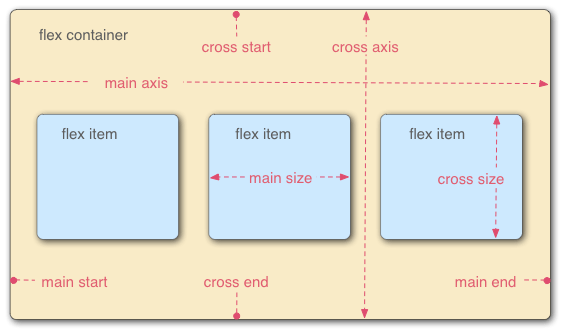

# HTML & CSS

## HTML, CSS, JavaScript

| HTML | CSS | JavaScript |
| --- | --- | --- |
| Structure<br>구조 | Presentation<br>표현 | Interaction<br>상호작용 |

:::tip[further reading]

- [Separation of concerns - Wikipedia](https://en.wikipedia.org/wiki/Separation_of_concerns)

:::

## HTML: HyperText Markup Language

### Self-closing start tag

```html
<!-- valid -->


<!-- invalid -->
</img>
```

HTML 문법에서는 `` 같은 void element, 태그 내부에 내용이 들어가지 않는 요소들은 self-closing('/')이 있을 수 있으나 end tag는 없는 편이 올바르다.

:::note
XML 문법에서는 empty element에 self-closing이나 end tag가 반드시 있어야 한다.
:::

:::note[references]

- [HTML 5: Is it , , or ?](https://stackoverflow.com/questions/1946426/html-5-is-it-br-br-or-br)
- [HTML](https://html.spec.whatwg.org/multipage/syntax.html#elements-2)
- [Extensible Markup Language (XML) 1.1 (Second Edition)](https://www.w3.org/TR/2006/REC-xml11-20060816/#sec-starttags)

:::

### `<section>` vs. `<div>`

#### [`<section>`](https://developer.mozilla.org/en-US/docs/Web/HTML/Element/section)

웹 페이지의 큰 의미 단위가 되는 구역을 구분하는 데 사용된다.  
HTML5 표준과 함께 생긴 [시맨틱 요소](https://developer.mozilla.org/en-US/docs/Glossary/Semantics)의 일부로 요소 이름 자체에 의미를 담고 있다.  
[`<nav>`](https://developer.mozilla.org/en-US/docs/Web/HTML/Element/nav), [`<article>`](https://developer.mozilla.org/en-US/docs/Web/HTML/Element/article), [`<aside>`](https://developer.mozilla.org/en-US/docs/Web/HTML/Element/aside), [`<main>`](https://developer.mozilla.org/en-US/docs/Web/HTML/Element/main) 등 특수한 의미를 담고 있는 요소를 사용하지 않을 때 사용해야 한다.

#### [`<div>`](https://developer.mozilla.org/en-US/docs/Web/HTML/Element/div)

HTML5 이전에 구역(division)을 나타내기 위해 범용적으로 사용하던 요소이다.  
모던 웹에서는 내용에 상관 없이 스타일을 적용하기 위해서만 사용하는 편이 좋다.

:::note[references]

- [Extensible Markup Language (XML) 1.1 (Second Edition)](https://www.w3.org/TR/2006/REC-xml11-20060816/#sec-starttags)

:::

### [`<pre>`](https://developer.mozilla.org/en-US/docs/Web/HTML/Element/pre)

HTML에 작성한 내용 그대로, 미리 서식을 지정한 텍스트를 나타내는 요소.  
보통 고정폭(monospace) 글꼴로 렌더링되고 요소 내 공백을 그대로 유지한다.  
ASCII 아트 등을 표현할 때 쓰일 수 있다.

### Formatting Elements

#### [`<strong>`](https://developer.mozilla.org/en-US/docs/Web/HTML/Element/strong)

높은 중요도를 나타낼 때 사용한다.  
보통 볼드체로 표시된다.

:::note

[`<b>`](https://developer.mozilla.org/en-US/docs/Web/HTML/Element/b)는 의미가 딱히 없는 경우에만 사용된다.

:::

#### [`<em>`](https://developer.mozilla.org/en-US/docs/Web/HTML/Element/em)

텍스트의 강세를 표현할 때 사용한다.  
보통 이탤릭체로 표시된다.

:::note

같은 이탤릭체로 표현되는 [`<i>`](https://developer.mozilla.org/en-US/docs/Web/HTML/Element/i)는 일반 산문과 다른 문체를 가질 때에 사용한다.

:::

#### [`<mark>`](https://developer.mozilla.org/en-US/docs/Web/HTML/Element/mark)

텍스트에 마킹, 하이라이트를 줄 때 사용한다.  
보통 노란 배경색으로 표시된다. (형광펜 효과)

#### [`<sub>`](https://developer.mozilla.org/en-US/docs/Web/HTML/Element/sub)

아래 첨자를 표현할 때 사용한다.

#### [`<del>`](https://developer.mozilla.org/en-US/docs/Web/HTML/Element/del)

삭제된 텍스트를 표현할 때 사용한다.  
보통 취소선으로 나타난다.

### [`<bdo>`](https://developer.mozilla.org/en-US/docs/Web/HTML/Element/bdo)

The Bidirectional Text Override element.  
적힌 텍스트의 방향을 다시 정해준다.  
`dir` 속성이 방향을 정한다.

- `ltr`: 왼쪽에서 오른쪽
- `rtl`: 오른쪽에서 왼쪽

### [`<a>`](https://developer.mozilla.org/en-US/docs/Web/HTML/Element/a)의 [`target`](https://developer.mozilla.org/en-US/docs/Web/HTML/Element/a#attr-target) 속성

#### `_self`

링크가 현재 browsing context에 열린다. (기본값)

#### `_blank`

보통 링크가 새 탭에 열리지만 사용자 설정에 따라 새 창으로 열릴 수 있다.

#### `_parent`

링크가 부모 browsing context에 열린다. 부모 context가 없는 경우 `_self`와 같다.

#### `_top`

링크가 가장 위에 있는 browsing context에 열린다. 따로 해당 context가 없는 경우 `_self`와 같다.

:::tip[further reading]

- [W3Schools HTML Exercise](https://www.w3schools.com/html/exercise.asp)
- [Structuring the web with HTML - Learn web development | MDN](https://developer.mozilla.org/en-US/docs/Learn/HTML)
- [HTML: HyperText Markup Language | MDN](https://developer.mozilla.org/en-US/docs/Web/HTML)

:::

## CSS: Cascading Style Sheet

### [CSS Selectors](https://developer.mozilla.org/en-US/docs/Web/CSS/CSS_Selectors)

#### [Type 셀렉터](https://developer.mozilla.org/en-US/docs/Web/CSS/Type_selectors)

```css
p { }
```

#### [전체 셀렉터](https://developer.mozilla.org/en-US/docs/Web/CSS/Universal_selectors)

```css
* { }
```

#### [셀렉터 list](https://developer.mozilla.org/en-US/docs/Web/CSS/Selector_list)

```css
h1, p { }
```

#### [ID 셀렉터](https://developer.mozilla.org/en-US/docs/Web/CSS/ID_selectors)

```css
#home { }
```

#### [Class 셀렉터](https://developer.mozilla.org/en-US/docs/Web/CSS/Class_selectors)

```css
.board { }
```

#### [Attribute 셀렉터](https://developer.mozilla.org/en-US/docs/Web/CSS/Attribute_selectors)

```css
a[href] { }
```

#### [후손 셀렉터](https://developer.mozilla.org/en-US/docs/Web/CSS/Descendant_combinator)

```css
body p {}
```

#### [자식 셀렉터](https://developer.mozilla.org/en-US/docs/Web/CSS/Child_combinator)

```css
body > p { }
```

#### [인접 형제 셀렉터](https://developer.mozilla.org/en-US/docs/Web/CSS/Adjacent_sibling_combinator)

```css
body + p { }
```

#### [형제 셀렉터](https://developer.mozilla.org/en-US/docs/Web/CSS/General_sibling_combinator)

```css
body ~ p { }
```

#### [가상 클래스](https://developer.mozilla.org/en-US/docs/Web/CSS/Pseudo-classes)

```css
a:link { }
a:visited { }
a:hover { }
a:active { }
a:focus { }
```

:::tip[further reading]

- [`:root`](https://developer.mozilla.org/en-US/docs/Web/CSS/:root)

:::

#### [요소 상태 셀렉터](https://developer.mozilla.org/en-US/docs/Web/CSS/Pseudo-classes#input_pseudo-classes)

```css
input:checked { }
input:enabled { }
input:disabled { }
```

#### [정합성 확인 셀렉터](https://developer.mozilla.org/en-US/docs/Web/CSS/Pseudo-classes#input_pseudo-classes)

```css
input[type="text"]:valid { }
input[type="text"]:invalid { }
```

#### [구조 가상 클래스 셀렉터](https://developer.mozilla.org/en-US/docs/Web/CSS/Pseudo-classes#tree-structural_pseudo-classes)

```css
li:first-child { }
li:last-child { }
li:nth-child(2n) { }
li:nth-child(2n+1) { }
li:nth-last-child(2) { }
li:nth-last-child(2n + 1) { }
p:first-of-type { }
p:last-of-type { }
p:nth-of-type(2) { }
p:nth-last-of-type(1) { }
```

#### [부정 셀렉터](https://developer.mozilla.org/en-US/docs/Web/CSS/:not)

```css
input:not([type="password"]) { }
p:not(:nth-of-type(2)) { }
```

### 적용 우선순위

1. Inline `style`
2. `!important`
3. ID 셀렉터
4. Class 셀렉터
5. Type 셀렉터
6. 전체 셀렉터

우선순위가 겹치는 경우 좀 더 구체적인 순, CSS 내에서 마지막으로 작성된 순으로 적용된다.

:::note[references]

- [Introducing the CSS Cascade - CSS: Cascading Style Sheets | MDN](https://developer.mozilla.org/en-US/docs/Web/CSS/Cascade)

- [Specificity - CSS: Cascading Style Sheets | MDN](https://developer.mozilla.org/en-US/docs/Web/CSS/Specificity)

:::

### [`box-sizing`](https://developer.mozilla.org/en-US/docs/Web/CSS/box-sizing)

#### `content-box`

CSS 기본 설정값으로 `width`, `height` 속성이 padding, border, margin의 크기를 제외한 컨텐츠의 크기만을 의미하게 된다.  
컨텐츠를 padding, border와 상관 없이 정해진 위치에 표시하는 경우에 사용할 수 있다.

#### `border-box`

`width`, `height` 속성이 컨텐츠의 크기와 함께 padding, border의 크기도 포함하게 된다.  
요소들의 레이아웃을 설정할 때 유용하다.

### [`margin`](https://developer.mozilla.org/en-US/docs/Web/CSS/margin): auto;

`margin` 속성에 `auto` 값을 사용하면 브라우저에서 적당한 margin을 골라준다.  
보통 요소를 가운데 정렬해준다.

### [`position`](https://developer.mozilla.org/en-US/docs/Web/CSS/position)

```css
position: static;
position: relative;
position: absolute;
position: fixed;
position: sticky;
```

요소가 문서에서 어떤 방식으로 배치될 지 설정한다.  
Flexbox와 같이 여러 item을 다루는 경우가 아닐 때 유용하다.

### [`float`](https://developer.mozilla.org/en-US/docs/Web/CSS/float)

```css
float: left;
float: right;
```

요소가 컨테이너의 왼쪽이나 오른쪽에 위치하게 하고 다른 텍스트나 인라인 요소가 이 요소를 감쌀 수 있게 한다.

### 페이지 레이아웃 리셋

HTML 문서는 브라우저 마다 기본적인 스타일을 가지고 있다.  
이런 기본 스타일이 전체적인 레이아웃을 설정할 때에는 방해가 될 수 있다.  
방해가 되는 요소는 예를 들어 다음과 같다.

- `<body>` 요소의 기본 여백
- `width`, `height` 속성이 여백을 포함하지 않음
- 브라우저에 따라 다른 여백, 글꼴

이런 문제를 해결하기 위해 [Normalize.css](https://github.com/necolas/normalize.css)와 같은 라이브러리로 CSS 리셋을 할 수 있지만 모던 웹 환경에서는 기본 스타일 자체도 큰 문제가 없는 경우가 많아서 최소한의 리셋만 적용하는 것으로도 충분하다.

아래와 같은 코드를 CSS 앞부분에 추가하여 원하는 결과를 얻을 수 있다.

```css
* {
    box-sizing: border-box;
}

body {
    margin: 0;
    padding: 0;
}
```

:::note[references]

- [Guidelines for styling CSS code examples - The MDN Web Docs project | MDN](https://developer.mozilla.org/en-US/docs/MDN/Writing_guidelines/Writing_style_guide/Code_style_guide/CSS#dont_use_resets)

:::

### Flexbox

```css
div {
    display: flex;
}
```

위와 같이 적음으로써 부모 요소는 flex container가 되고 flexbox 관련 속성을 적용할 수 있다.
자식 요소들은 flex item이라고 부른다.



#### Flex container 속성들

##### [`justify-content`](https://developer.mozilla.org/en-US/docs/Web/CSS/justify-content)

Main axis에 대해 flex item을 어떻게 정렬할 지 설정한다.

##### [`align-items`](https://developer.mozilla.org/en-US/docs/Web/CSS/align-items)

Cross axis에 대해 flex item을 어떻게 정렬할 지 설정한다.

##### [`flex-direction`](https://developer.mozilla.org/en-US/docs/Web/CSS/flex-direction)

Main axis의 방향을 설정한다.

##### [`flex-wrap`](https://developer.mozilla.org/en-US/docs/Web/CSS/flex-wrap)

Flex item의 줄바꿈을 설정한다.

##### [`flex-flow`](https://developer.mozilla.org/en-US/docs/Web/CSS/flex-flow)

`flex-direction`과 `flex-wrap`의 축약형이다.

##### [`align-content`](https://developer.mozilla.org/en-US/docs/Web/CSS/align-content)

줄바꿈시 각 줄을 cross axis에 대해 어떻게 정렬할 지 설정한다.

##### [`gap`](https://developer.mozilla.org/ko/docs/Web/CSS/gap)

Flex item들 사이의 간격을 설정한다.

#### Flex item 속성들

##### [`flex-grow`](https://developer.mozilla.org/en-US/docs/Web/CSS/flex-grow)

Flex item들이 늘어날 때 얼마나 늘어날 것인지 설정한다.
모든 flex item들의 grow값에 대한 비율에 따라 늘어나는 정도가 결정된다.

##### [`flex-shrink`](https://developer.mozilla.org/en-US/docs/Web/CSS/flex-shrink)

Flex item들이 줄어들 때 얼마나 줄어들 것인지 설정한다.
모든 flex item들의 shrink값에 대한 비율에 따라 줄어드는 정도가 결정된다.

##### [`flex-basis`](https://developer.mozilla.org/en-US/docs/Web/CSS/flex-basis)

Flex item의 기본 크기를 설정한다.
Main axis의 방향에 따라 `width`나 `height` 속성을 덮어쓴다.
`auto` 값을 가지는 경우 컨텐츠의 원래 `width`나 `height`를 따라간다.

##### [`flex`](https://developer.mozilla.org/en-US/docs/Web/CSS/flex)

`flex-grow`, `flex-shrink`,`flex-basis`의 축약형이다.

##### [`order`](https://developer.mozilla.org/en-US/docs/Web/CSS/order)

Flex item의 순서를 설정한다.
Order 값에 따라 오름차순으로 flex item들이 정렬된다.

##### [`align-self`](https://developer.mozilla.org/en-US/docs/Web/CSS/align-self)

부모의 `align-items` 속성을 덮어쓰고 자신을 cross axis에 대해 어떻게 정렬할 지 설정한다.

:::note[references]

- [Flexbox Froggy](https://flexboxfroggy.com/)
- [CSS Flexible Box Layout - CSS: Cascading Style Sheets | MDN](https://developer.mozilla.org/en-US/docs/Web/CSS/CSS_Flexible_Box_Layout)
- [Flexbox - Learn web development | MDN](https://developer.mozilla.org/en-US/docs/Learn/CSS/CSS_layout/Flexbox)

:::

:::tip[further reading]

- [W3Schools CSS Exercise](https://www.w3schools.com/css/exercise.asp)
- [Learn to style HTML using CSS - Learn web development | MDN](https://developer.mozilla.org/en-US/docs/Learn/CSS)
- [CSS: Cascading Style Sheets | MDN](https://developer.mozilla.org/en-US/docs/Web/CSS)

:::

## 웹 앱 화면 설계

### 와이어프레임 설계 및 목업 구현

#### [와이어프레임](https://en.wikipedia.org/wiki/Website_wireframe)

웹 또는 앱을 개발할 때 레이아웃의 뼈대를 그린 것을 와이어프레임이라고 한다.
와이어로 설계된 모양이라는 의미로 단순한 선, 도형으로 웹 또는 앱의 인터페이스를 묘사한다.
단순하게 레이아웃을 보여주는 용도라서 전환 효과, 애니메이션, 유저 테스트와 같은 스타일링, UX와는 거리가 멀다.

:::note

[Figma](https://www.figma.com/), [Miro](https://miro.com/), [Oven](https://ovenapp.io/), PowerPoint 등의 툴을 사용한다.

:::

#### [목업](https://en.wikipedia.org/wiki/Mockup#Software_engineering)

목업은 실물 모형을 의미하는데 웹 또는 앱은 HTML과 CSS를 사용하여 동적인 부분을 제외하고 실제 제품의 모습, UI만 똑같게 만든 것이 목업이 된다.

### HTML로 웹 앱 구조 잡기

1. 큰 틀의 영역 나누기
2. 각 영역을 적합한 요소로 표현하기  
Semantic 요소 사용 고려 (e.g. `<div>` 대신 `<article>` 사용)

#### `id`와 `class`

- `id`: 고유(unique)한 영역을 표현할 때, 불필요한 경우 사용 지양
- `class`: 반복되는 영역을 유형별로 분류할 때, 스타일링을 위해 주로 사용

:::note[references]

- [Google HTML/CSS Style Guide](https://google.github.io/styleguide/htmlcssguide.html#id_Attributes)

:::
