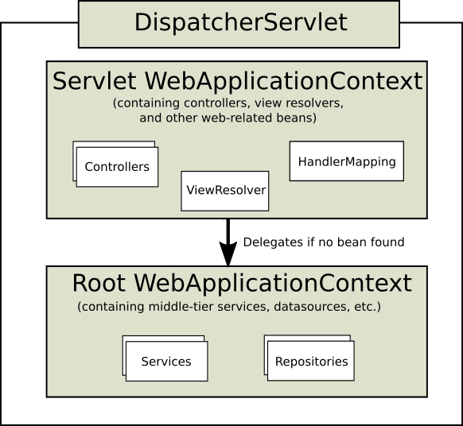

# Spring Web MVC

## [`DispatcherServlet`](https://docs.spring.io/spring-framework/docs/current/javadoc-api/org/springframework/web/servlet/DispatcherServlet.html)



Spring MVC는 `DispatcherServlet`이 애플리케이션의 중심에서 요청 처리를 위해 공유되는 알고리즘을 제공하고 실제 동작은 따로 설정 가능한 대리 컴퍼넌트가 하게 되는 [front controller](https://en.wikipedia.org/wiki/Front_controller) 패턴으로 설계되었다.

### 기본적인 요청 처리 흐름

1. `DispatcherServlet`이 클라이언트로부터 요청을 전달받는다.
2. `DispatcherServlet`이 [`HandlerMapping`](https://docs.spring.io/spring-framework/docs/current/javadoc-api/org/springframework/web/servlet/HandlerMapping.html) 인터페이스에게 요청 처리에 적합한 Controller를 찾는 작업을 위임한다.
3. `HandlerMapping`으로부터 받은 controller 정보를 바탕으로 `DispatcherServlet`이 [`HandlerAdapter`](https://docs.spring.io/spring-framework/docs/current/javadoc-api/org/springframework/web/servlet/HandlerAdapter.html) 인터페이스에게 해당 controller 클래스 내의 handler 메서드를 호출하는 작업을 위임한다.
4. `HandlerAdapter`가 controller 내의 handler를 호출하여 model과 [`View`](https://docs.spring.io/spring-framework/docs/current/javadoc-api/org/springframework/web/servlet/View.html) 정보를 받아오고 이를 바탕으로 `DispatcherServlet`이 적합한 `View` 인터페이스를 찾는 작업을 [`ViewResolver`](https://docs.spring.io/spring-framework/docs/current/javadoc-api/org/springframework/web/servlet/ViewResolver.html) 인터페이스에게 위임한다.
5. `ViewResolver`에게 받은 `View` 정보를 바탕으로 `DispatcherServlet`이 `View`에게 응답 데이터 생성(렌더링)을 위임한다.
6. `View`로부터 받은 응답 데이터를 `DispatcherServlet`이 클라이언트로 전달한다.

:::note[Reference]

[`DispatcherServlet`](https://docs.spring.io/spring-framework/reference/web/webmvc/mvc-servlet.html)

:::

## [`@SpringBootApplication`](https://docs.spring.io/spring-boot/docs/current/api/org/springframework/boot/autoconfigure/SpringBootApplication.html)

[Using the @SpringBootApplication Annotation](https://docs.spring.io/spring-boot/docs/current/reference/html/using.html#using.using-the-springbootapplication-annotation)

## [`@RequestMapping`](https://docs.spring.io/spring-framework/docs/current/javadoc-api/org/springframework/web/bind/annotation/RequestMapping.html)

- [Method Arguments](https://docs.spring.io/spring-framework/reference/web/webmvc/mvc-controller/ann-methods/arguments.html)
- [Return Values](https://docs.spring.io/spring-framework/reference/web/webmvc/mvc-controller/ann-methods/return-types.html)
  - [`ResponseEntity`](https://docs.spring.io/spring-framework/docs/current/javadoc-api/org/springframework/http/ResponseEntity.html)

:::tip[further reading]

- [MIME types (IANA media types) - HTTP | MDN](https://developer.mozilla.org/en-US/docs/Web/HTTP/Basics_of_HTTP/MIME_Types)
- [HTTP request methods - HTTP | MDN](https://developer.mozilla.org/en-US/docs/Web/HTTP/Methods)
- [HTTP response status codes - HTTP | MDN](https://developer.mozilla.org/en-US/docs/Web/HTTP/Status)

:::

## [HTTP Headers](https://developer.mozilla.org/en-US/docs/Web/HTTP/Headers)

- [`HttpServletRequest`](https://jakarta.ee/specifications/servlet/5.0/apidocs/jakarta/servlet/http/httpservletrequest)에서 요청 header를 확인할 수 있고,  
[`HttpServletResponse`](https://jakarta.ee/specifications/servlet/5.0/apidocs/jakarta/servlet/http/httpservletresponse)에 응답 header를 설정할 수 있다.
- [User-Agent](https://developer.mozilla.org/en-US/docs/Web/HTTP/Headers/User-Agent)
- **Custom Headers**
  - [HTTP headers and Application Load Balancers, AWS ELB](https://docs.aws.amazon.com/elasticloadbalancing/latest/application/x-forwarded-headers.html)
  - [Create custom headers in backend services, Google Cloud Load Balancing](https://cloud.google.com/load-balancing/docs/https/custom-headers)

## REST Clients

- [REST Clients](https://docs.spring.io/spring-framework/reference/integration/rest-clients.html)
- [`RestTemplate`](https://docs.spring.io/spring-framework/docs/current/javadoc-api/org/springframework/web/client/RestTemplate.html)
- [`WebClient`](https://docs.spring.io/spring-framework/docs/current/javadoc-api/org/springframework/web/reactive/function/client/WebClient.html)

## URI Links

- [URI Links](https://docs.spring.io/spring-framework/reference/web/webmvc/mvc-uri-building.html)
- [List of URI schemes](https://en.wikipedia.org/wiki/List_of_URI_schemes)
- [Percent-encoding](https://en.wikipedia.org/wiki/Percent-encoding)

## [`HttpMessageConverter`](https://docs.spring.io/spring-framework/docs/current/javadoc-api/org/springframework/http/converter/HttpMessageConverter.html)

- [Message Converters](https://docs.spring.io/spring-framework/reference/integration/rest-clients.html#rest-message-conversion)
- [Message Conversion](https://docs.spring.io/spring-framework/docs/current/reference/html/integration.html#rest-message-conversion)

## Validation

- [Jakarta Bean Validation specification](https://jakarta.ee/specifications/bean-validation/3.0/jakarta-bean-validation-spec-3.0.html)
- [Documentation - Hibernate Validator](https://hibernate.org/validator/documentation/)

### `@Valid`, `@Validated`

- 핸들러 메서드에서 `@Valid`나 `@Validated`를 `@RequestBody`와 같은 매개변수에 써서 인자로 들어오는 객체를 validation할 수 있다.
- 메서드 매개변수에 `@Positive` 등 Java Bean Validation API를 사용하려면 클래스나 메서드에 `@Validated`를 작성해야 한다.
  - 인자로 들어오는 객체 자체를 validation하는 데에는 굳이 클래스, 메서드 단계에 `@Validated`를 작성할 필요없다.

:::note[references]

- [`@RequestBody`](https://docs.spring.io/spring-framework/reference/web/webmvc/mvc-controller/ann-methods/requestbody.html)

:::

## [Lombok](https://projectlombok.org/features/all)

`@Getter`, `@Setter`, `@AllArgsConstructor`, `@NoArgsConstructor`, `@Data`, `@ToString` 

## [MapStruct](https://mapstruct.org/)

### Gradle Configuration

```gradle
...
plugins {
    ...
    id "com.diffplug.eclipse.apt" version "3.26.0" // Only for Eclipse
}

dependencies {
    ...
    implementation "org.mapstruct:mapstruct:${mapstructVersion}"
    annotationProcessor "org.mapstruct:mapstruct-processor:${mapstructVersion}"

    // If you are using mapstruct in test code
    testAnnotationProcessor "org.mapstruct:mapstruct-processor:${mapstructVersion}"
}
...
```

### Examples

[mapstruct/mapstruct-examples](https://github.com/mapstruct/mapstruct-examples)

:::note[Reference]

[MapStruct Reference Guide](https://mapstruct.org/documentation/stable/reference/html/)

:::

## Exception Handling

### [`@ExceptionHandler`](https://docs.spring.io/spring-framework/docs/current/javadoc-api/org/springframework/web/bind/annotation/ExceptionHandler.html)

- [`BindingResult`](https://docs.spring.io/spring-framework/docs/current/javadoc-api/org/springframework/validation/BindingResult.html)
- [`ConstraintViolation`](https://jakarta.ee/specifications/bean-validation/3.0/apidocs/jakarta/validation/constraintviolation)
- [`ConstraintViolationImpl`](https://docs.jboss.org/hibernate/stable/validator/api/org/hibernate/validator/internal/engine/ConstraintViolationImpl.html)

### [`@RestControllerAdvice`](https://docs.spring.io/spring-framework/docs/current/javadoc-api/org/springframework/web/bind/annotation/RestControllerAdvice.html)

[ControllerAdvice](https://docs.spring.io/spring-framework/docs/current/javadoc-api/org/springframework/web/bind/annotation/ControllerAdvice.html)

:::note[references]

- [Model](https://docs.spring.io/spring-framework/reference/web/webmvc/mvc-controller/ann-modelattrib-methods.html)
- [`DataBinder`](https://docs.spring.io/spring-framework/reference/web/webmvc/mvc-controller/ann-initbinder.html)
- [Exceptions](https://docs.spring.io/spring-framework/reference/web/webmvc/mvc-controller/ann-exceptionhandler.html)
- [Controller Advice](https://docs.spring.io/spring-framework/reference/web/webmvc/mvc-controller/ann-advice.html)

:::

### Checked vs Unchecked Exceptions

- [Unchecked Exceptions - The Controversy](https://docs.oracle.com/javase/tutorial/essential/exceptions/runtime.html)
- [`RuntimeException`](https://docs.oracle.com/en/java/javase/17/docs/api/java.base/java/lang/RuntimeException.html)
- [How to Handle Checked & Unchecked Exceptions in Java](https://rollbar.com/blog/how-to-handle-checked-unchecked-exceptions-in-java/)
